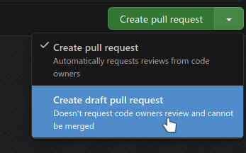
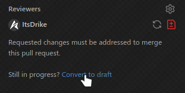

!!! bug "Work In Progress"

    This page is missing a guide on writing a good PR body

# Pull Requests

Welcome! If you're interested in contributing to mcproto, you've come to the right place. mcproto is an open-source
project, and we welcome contributions from anyone eager to help out.

To contribute, you can create a [pull request](https://docs.github.com/en/pull-requests) on our GitHub repository.
Your pull request will then be reviewed by our maintainers, and once approved, it will be merged into the main
repository. Contributions can include bug fixes, documentation updates, or new features.

!!! danger "Code quality requirements"

    While we encourage and appreciate contributions, maintaining high code quality is crucial to us. That means you
    will need to adhere to our code quality standards. Contributions may be rejected if they do not meet these
    guidelines.

## Get assigned to the issue

The very first thing you will need to do is deciding what you actually want to work on. In all likelihood, you already
have something in mind if you're reading this, however, if you don't, you're always free to check the opened GitHub
issues. If you find anything interesting there that you'd wish to work on, leave a comment on that issue with something
like: "I'd like to work on this".

Even if you do have an idea already, we heavily recommend (though not require) that you first make an issue, this can
be a [bug report](./reporting-a-bug.md), but also a feature request, or something else. Once you made the issue, leave
a: "I'd like to work on this" comment on it.

Eventually, a maintainer will get back to you and you will be assigned to the issue. By getting assigned, you reserve
the right to work on that given issue and it also prevents us (or someone else) from potentially working on the same
thing that you're already addressing. This is also the reason why we recommend creating an issue first. Being assigned
is a soft approval from us, giving you the green light to start coding.

Of course, you are welcome to start working on the issue even before being officially assigned. However, please be
aware that sometimes, we may choose not to pursue a certain feature / bugfix. In such cases, your work might not end up
being used, which would be a shame.

!!! note "Minor tasks don't need an issue"

    While we generally do encourage contributors to first create an issue and get assigned to it first. If you're
    just fixing a typo, improving the wording, or making some minor optimizations to the code, you can safely skip
    this step.

    The point of encouraging issues is to prevent needlessly wasting people's time. However, with these minor tasks,
    it might actually take you longer to create a full issue about the problem than it would to just submit a fix.

    There's therefore no point in cluttering the issue tracker with a bunch of small issues that can often be
    changed in just a few minutes.

## Pull Request Body

TODO

## Work in Progress PRs

Whenever you open a pull request that isn't yet ready to be reviewed and merged, you can mark it as a **draft**. This
provides both visual and functional indicator that the PR isn't yet ready to be merged.

Methods of marking PR as a draft:

| **When creating it**                      | **After creation**                          |
| ----------------------------------------- | ------------------------------------------- |
|  |  |

Once your work is done and you think the PR is ready to be merged, mark it as **Ready for review**

{ width="600" }

## Contributing guidelines

In order to make a successful contribution, it is **required** that you get familiar with our [contributing guidelines](./guides/index.md).

## Automated checks

The project includes various CI workflows that will run automatically for your pull request after every push and check
your changed with various tools. These tools are here to ensure that our contributing guidelines are met and ensure
good code quality of your PR.

That said, you shouldn't rely on these CI workflows to let you know if you made a mistake, instead, you should run
these tools on your own machine during the development. Many of these tools can fix the violations for you
automatically and it will generally be a better experience for you. Running these tools locally will also prevent a
bunch of "Fix the CI" commits, which just clutter the git history.

Make sure to read our [contributing guidelines](./guides/index.md) thoroughly, as they describe how to use these tools
and even how to have them run automatically before each commit, so you won't forget.

Passing the CI workflows is a requirement in order to get your pull request merged. If a maintainer sees a PR that's
marked as ready for review, but isn't passing the CI, we'll often refrain from even reviewing it, as we consider it
incomplete. If you have a technical reason why your PR can't pass the CI, let us know in the PR description or a
comment.

## Code Review

All pull requests will need to be reviewed by at least one team member before merging. The reviewer will provide
feedback and suggestions for improvement.

Once a reviewer approves your pull request, it can be merged into the `main` branch.

??? question "How do I request a review?"

    Request a review from a team member by [assigning them as a reviewer][assigning-pr-reviewer] to your pull request.

    However, you can also just wait until we get to your PR, you don't need to assign a reviewer unless you want
    someone specific to review. Just make sure that your PR is marked as ready for review and not draft.

[assigning-pr-reviewer]: https://docs.github.com/en/pull-requests/collaborating-with-pull-requests/proposing-changes-to-your-work-with-pull-requests/requesting-a-pull-request-review

### Giving Feedback

If you wish, you can also provide some feedback on other PRs. Doing so is a great way to fill the time while you're
waiting for your PR to be reviewed by us and you're also speeding up the process, as it reduces the amount of time
we'd have to spend reviewing those other PRs before getting to yours.

When reviewing a pull request, aim to be constructive and specific. Highlight areas that need improvement and suggest
potential solutions. If you have any questions on concerns about something in the code, don't hesitate to ask the
author for clarification.

Focus on the following aspects during a code review:

- Correctness and functionality
- Code quality and readability
- Adherence to the project guidelines

??? example "Good Code Review Feedback"

    Here are some examples of a good code review feedback:

    ```
    - Great work on the new function! The implementation looks good overall.
    - The tests cover most of the functionality, but it's are missing a test case for edge case X. Could you add a test for that?
    - The logic in the new function is somewhat complex. Consider breaking it into smaller functions for better clarity.
    - The new feature is well-implemented, but it would be great to add more inline comments to explain the logic, as
      it isn't trivial to understand.
    - There's a small typo in the docstring. Could you correct it?
    - The configuration settings are hard-coded. Can you move them to a configuration file to make it easier to manage?
    ```

Always be respectful and considerate when giving feedback. Remember that the goal is to improve the code and help the
author grow as a developer.

!!! success "Be Positive"

    Don't forget to acknowledge the positive aspects of the contribution as well!
