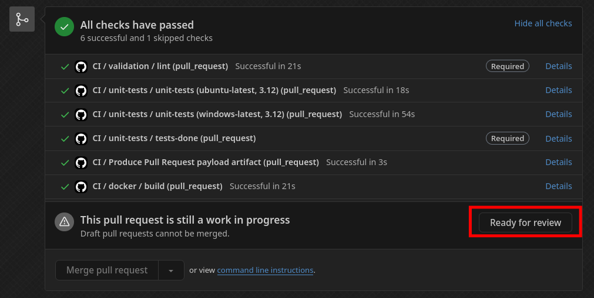

# Pull Requests

Welcome! If you're interested in contributing to mcproto, you've come to the right place. mcproto is an open-source
project, and we welcome contributions from anyone eager to help out.

To contribute, you can create a [pull request](https://docs.github.com/en/pull-requests) on our GitHub repository.
Your pull request will then be reviewed by our maintainers, and once approved, it will be merged into the main
repository. Contributions can include bug fixes, documentation updates, or new features.

!!! danger "Code quality requirements"

    While we encourage and appreciate contributions, maintaining high code quality is crucial to us. That means you
    will need to adhere to our code quality standards. Contributions may be rejected if they do not meet these
    guidelines.

## Get assigned to the issue

The very first thing you will need to do is deciding what you actually want to work on. In all likelihood, you already
have something in mind if you're reading this, however, if you don't, you're always free to check the opened GitHub
issues. If you find anything interesting there that you'd wish to work on, leave a comment on that issue with something
like: "I'd like to work on this".

Even if you do have an idea already, we heavily recommend (though not require) that you first make an issue, this can
be a [bug report](./reporting-a-bug.md), but also a feature request, or something else. Once you made the issue, leave
a: "I'd like to work on this" comment on it.

Eventually, a maintainer will get back to you and you will be assigned to the issue. By getting assigned, you reserve
the right to work on that given issue and it also prevents us (or someone else) from potentially working on the same
thing that you're already addressing. This is also the reason why we recommend creating an issue first. Being assigned
is a soft approval from us, giving you the green light to start coding.

Of course, you are welcome to start working on the issue even before being officially assigned. However, please be
aware that sometimes, we may choose not to pursue a certain feature / bugfix. In such cases, your work might not end up
being used, which would be a shame.

## Work in Progress PRs

Whenever you open a pull request that isn't yet ready to be reviewed and merged, you can mark it as a **draft**. This
provides both visual and functional indicator that the PR isn't yet ready to be merged.

Methods of marking PR as a draft:

| **When creating it**                      | **After creation**                          |
| ----------------------------------------- | ------------------------------------------- |
|  |  |

Once your work is done and you think the PR is ready to be merged, mark it as **Ready for review**

{ width="600" }

## Contributing guidelines

In order to make a successful contribution, it is **required** that you get familiar with our [contributing guidelines](./guides/index.md).
